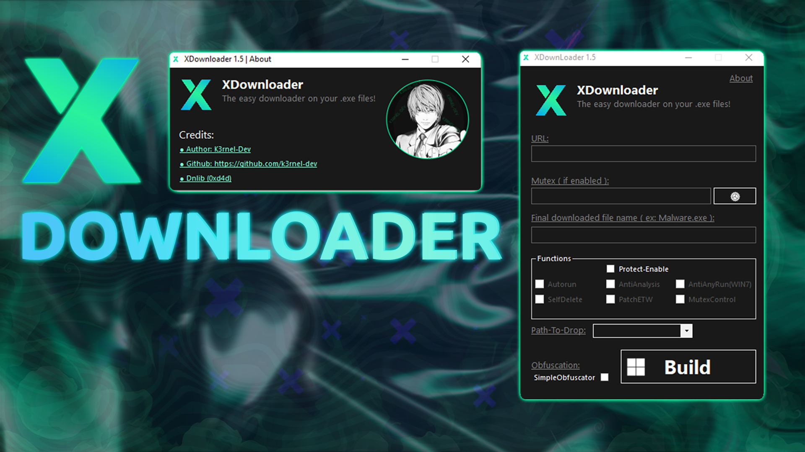

 

---

### > **[⬇️ Download for Windows](https://github.com/K3rnel-Dev/XDownloader/releases/tag/Build)**

---

# 🛡️ About 

<b>This project is a flat-ui design builder for compiling a file loader from a remote resource. It provides advanced features that can be optionally selected, with only the chosen functions being included in the final build.</b>


# ⚙️<b> Features</b>
- **Anti-Analysis**: Includes Anti-VM, Anti-Debug, Anti-Sandbox, and Anti-Process protection to block analysis tools and environments.
- **Autorun**: Enables the downloded file to run automatically on startup.
- **ETW Patching**: Patches Event Tracing for Windows (ETW) to evade detection by monitoring tools.
- **Anti AnyRun**: Prevents execution on the AnyRun platform (specifically for Windows 7).
- **Self Delete**: Deletes the executable after successful execution.
- **Mutex Control**: Creates a mutex in the system registry to prevent duplicate program instances.

<b>Additionally, the project includes: </b>

- **Conditional Compilation**: Only the selected features are compiled into the final build, reducing the footprint and improving performance.
- **Custom Obfuscation Engine**: Features renaming of functions and generation of junk methods to enhance code obfuscation, without affecting functionality.

<br>

## ⚠️ **Disclaimer**: 
```
This project is for educational purposes only, intended for studying malware and security techniques. The author is not responsible for any malicious use of this software.
```
<br>

# ⭐Credits 
- **Author**: <a href="https://github.com/k3rnel-dev">K3rnel-Dev</a>
- **dnlib**: A library for manipulating .NET assemblies.  
  GitHub: [https://github.com/0xd4d/dnlib](https://github.com/0xd4d/dnlib)

---
